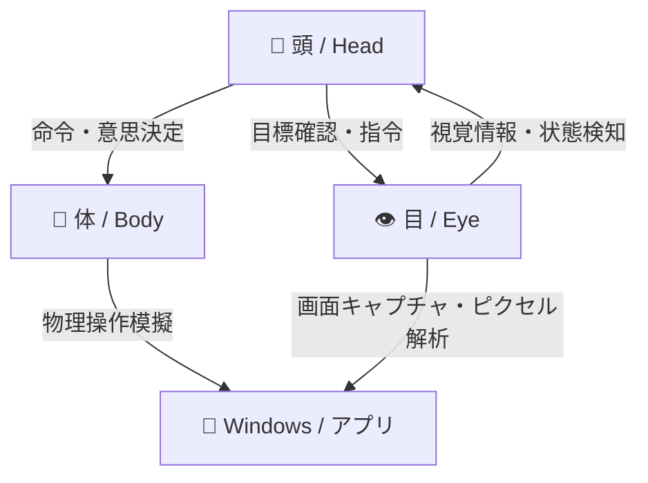

# 🧠 Head-Eye-Body (頭・目・体) 自律協調アーキテクチャ

コンピューター・コワークシステムにおいて、AIエージェントが人間と同等レベルのパターン動作を行うための、役割別の階層構造（頭・目・体）を設計・実装しました。

---

## 1. アーキテクチャ構成

### 🧠 ① 頭 (Head) — 意思決定・司令塔
* **役割**: 全体のタスクの進行、各フォルダ（脳モデル）の読み込み、および目と体の動作調整。
* **主要コード**: [heb_controller.py](file:///C:/Users/yu_ci/Desktop/GENRE_FOLDERS/AI/heb_controller.py) の `Head` クラス、および [brain_switchboard.py](file:///C:/Users/yu_ci/Desktop/GENRE_FOLDERS/AI/brain_switchboard.py)。
* **機能**: 「音ゲーをプレイする」「スライドを出力する」といった上位の目標をブレイクダウンし、**目**と**体**に適切なパラメータを指示します。

### 👁️ ② 目 (Eye) — 視覚センシング・検証
* **役割**: アプリケーション画面の取り込み、色情報や位置の自動キャリブレーション、状態変化の検証。
* **主要コード**: [heb_controller.py](file:///C:/Users/yu_ci/Desktop/GENRE_FOLDERS/AI/heb_controller.py) の `Eye` クラス。
* **機能**: 
  - 画面をキャプチャし、低解像度ハッシュで変化（差分）を判定（クリックの検証）。
  - 音ゲーレーンなどの特定ピクセルカラー（青／赤ノーツなど）の有無をミリ秒単位で高速スキャン。
  - ゲーム外枠の境界線をカラー変化から自動キャリブレーション。

### 💪 ③ 体 (Body) — モーター・動作実行
* **役割**: キーボードの打鍵やマウスカーソルの移動など、OSに対する物理インターフェース操作のシミュレート。
* **主要コード**: [heb_controller.py](file:///C:/Users/yu_ci/Desktop/GENRE_FOLDERS/AI/heb_controller.py) の `Body` クラス、および [ai_driver.py](file:///C:/Users/yu_ci/Desktop/GENRE_FOLDERS/AI/CORE/ai_driver.py)。
* **機能**:
  - **ベジェ曲線カーソル追従**: 開始位置から目標座標まで、自然な曲線とイージング（加減速）で動かし、機械的な瞬間移動（チート）を排除。
  - **ランダムディレイ**: キーの押し下げ時間や文字タイピング間隔を人間と同じゆらぎ（打鍵ディレイ）で実行。

---

## 2. 実装クラス対応表

| 階層 | Python クラス名 | 主な参照モジュール・機能 |
| :--- | :--- | :--- |
| **頭 (Head)** | `Head` / `BrainSwitchboard` | 脳フォルダの切替、実行パイプラインの管理 |
| **目 (Eye)** | `Eye` | `driver.capture()`, `getpixel()`, 画像検証ハッシュ比較 |
| **体 (Body)** | `Body` / `AIDriver` | `bezier_move()`, `hardware_click()`, `type_string()` |

---

## 3. 動的適用例 (音ゲーでのフロー)

1. **頭**: 音ゲー開始コマンドを受け取る。
2. **体**: 仮想キー `Enter` を送信し、ゲームをスタートさせる。
3. **目**: ゲームの枠がどこにあるかを色グラデーションの境界から自動検出。
4. **目**: レーン上部に配置された 4 つのセンサー（ピクセル検出ポイント）の色を毎フレーム監視。
5. **頭**: 「ノーツ（青／赤）がセンサーを通過した」と**目**から報告を受ける。
6. **体**: 対応するボタン (`D`, `F`, `J`, `K`) を人間に近いディレイ（ホールド）で素早く押す。
