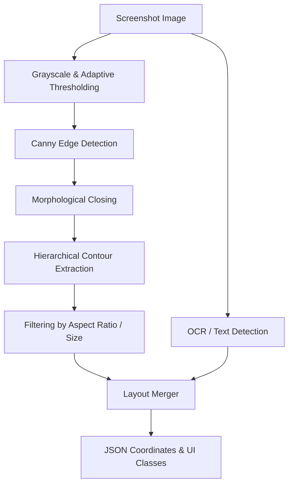

# State-of-the-Art UI Element Coordinate & Bounding Box Detection

This document provides a comprehensive survey of modern methodologies for detecting user interface (UI) elements and estimating their pixel coordinates on a screen. Bounding box and coordinate localization is a core prerequisite for reliable GUI automation, bridging high-level agent decisions with physical mouse/keyboard click events.

---

## 1. The Spatial Reasoning "Semantic Void" in LLMs

Standard Multimodal Large Language Models (MLLMs) excel at understanding the semantic content of a screenshot (e.g., "This is a checkout page"). However, they struggle with precise spatial grounding (returning exact `(x, y)` pixel coordinates for clicks). This is known as the **spatial reasoning void**, caused by:
1. **Tokenization Limits:** High-resolution screenshots are downsampled into patches (e.g., $14 \times 14$ pixel patches in CLIP), losing fine-grained grid information.
2. **Text-Centric Pre-training:** Standard pre-training focuses on text-image alignment rather than dense coordinate regression.

To overcome this, modern architectures utilize two main paradigms:
1. **Hybrid Systems (CV + OCR/DL):** Utilizing lightweight classical Computer Vision (CV) to extract candidate bounding boxes, combined with OCR or lightweight CNNs to verify element classes.
2. **Specialized Grounding VLMs (End-to-End):** Training VLMs with bounding box coordinates directly in their vocabulary (e.g., `<box_100, 200, 300, 400>`).

---

## 2. UIED: A Hybrid GUI Element Detection Toolkit (ESEC/FSE 2020)

**UIED** (User Interface Element Detection) by Mulong Xie et al. is a foundational hybrid toolkit designed to extract UI layouts. It utilizes:
- **Classical CV:** Bounding box extraction for non-text UI elements (buttons, inputs, images) using Canny edge detection, contour hierarchy analysis, and adaptive morphological operations.
- **Deep Learning / OCR:** Text extraction and localization using text-detection networks (e.g., EAST) or modern OCR engines.
- **Adjacency & Layout Merging:** A heuristic layout engine that groups adjacent bounding boxes (e.g., merging an icon box with a neighboring text box into a single button container).

### UIED Architecture Flow

---

## 3. Modern Benchmark: ScreenSpot and ScreenSpot-Pro

Evaluating the localization capability of GUI agents requires specialized benchmarks:
- **ScreenSpot:** A dataset containing thousands of GUI screenshots across Mobile (iOS, Android), Web, and Desktop environments, paired with natural language instructions (e.g., "Click the search bar"). Performance is evaluated using **Intersection over Union (IoU)** of predicted click coordinates against the target element's bounding box.
- **ScreenSpot-Pro:** An advanced, high-resolution iteration of ScreenSpot focusing on professional desktop environments (e.g., AutoCAD, Blender, PowerPoint). It features denser layouts, smaller icons, and complex multi-panel designs, exposing the limitations of generic VLMs.

---

## 4. State-of-the-Art VLM: UI-TARS (ByteDance)

**UI-TARS** is an open-source multimodal agent stack built on top of ByteDance's Seed-VLM series, optimized specifically for GUI agent tasks.

### Key Innovations:
1. **Coordinate Vocabulary:** Introduces native coordinate tokens representing normalized screen coordinate points:
   $$\text{x\_norm} = \frac{x}{\text{width}} \times 1000, \quad \text{y\_norm} = \frac{y}{\text{height}} \times 1000$$
2. **IoU-Augmented Training:** Trains the VLM to regress bounding boxes using a combined objective of Cross-Entropy (for classification) and Generalized Intersection over Union (GIoU) loss to optimize coordinate regression:
   $$\mathcal{L}_{\text{grounding}} = \mathcal{L}_{\text{CE}} + \lambda \mathcal{L}_{\text{GIoU}}$$
3. **High-Resolution Support:** Employs dynamic patch slicing to process full-HD (1920x1080) and 4K screens without losing small button features.

---

## 5. Lightweight Classical CV Algorithms (Local Execution)

For local execution on lightweight PCs where running high-parameter VLMs is impractical, classical CV algorithms represent the fastest and most robust coordinate extraction pipeline.

### A. Contour Extraction Pipeline
1. **Grayscale Conversion:** Simplify 3-channel RGB to 1-channel luminance to ignore color-scheme changes.
2. **Gaussian Blur:** Remove high-frequency noise that produces jagged edges.
3. **Adaptive Thresholding:** Separate UI elements from background gradients (crucial for modern CSS dark/light modes).
4. **Morphological Closing:** Close gaps in edges to form solid closed loops around buttons:
   $$\text{Closing}(A, B) = (A \oplus B) \ominus B$$
   where $\oplus$ represents dilation and $\ominus$ represents erosion with structuring element $B$.
5. **Contour Filtering:** Discard contours that are too small (noise) or too large (window background) using aspect ratio constraints:
   $$\text{Aspect Ratio} = \frac{\text{width}}{\text{height}}$$

### B. Template Matching (Normalized Cross-Correlation)
To locate pre-defined visual elements (e.g., specific game relics, app icons), **Normalized Cross-Correlation (NCC)** is used:
$$R(x,y) = \frac{\sum_{x',y'} (T(x',y') \cdot I(x+x', y+y'))}{\sqrt{\sum_{x',y'} T(x',y')^2 \cdot \sum_{x',y'} I(x+x', y+y')^2}}$$
where $T$ is the template image and $I$ is the screenshot.

- **Threshold Filtering:** Detections are valid if $R(x,y) \ge \text{Threshold}$ (typically $0.80$).
- **Multi-Scale Extension:** Re-scale the template or the source image iteratively to detect elements when the window resolution changes.
